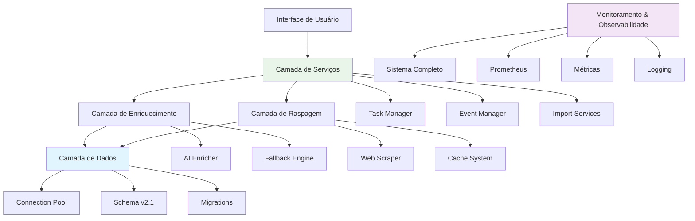
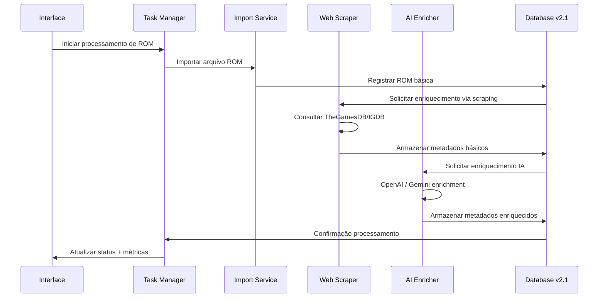
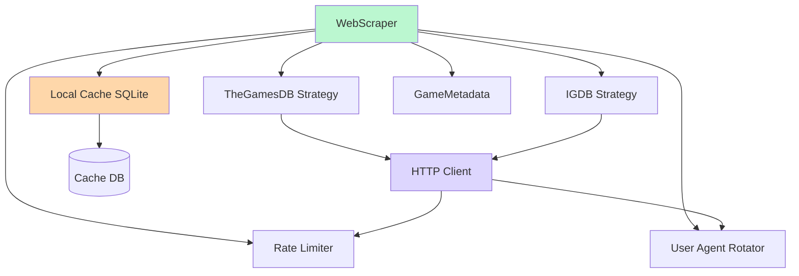
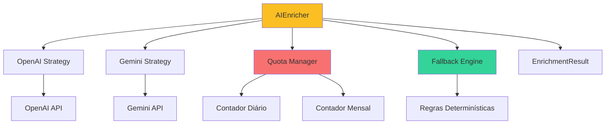
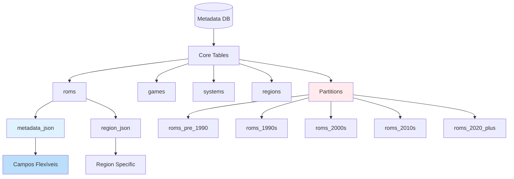
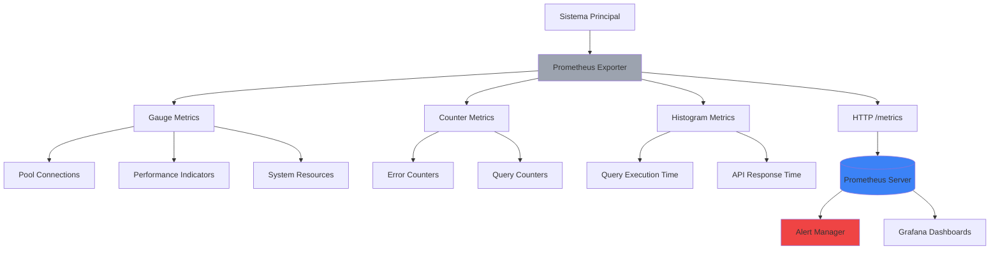

ocs/ARCHITECTURE.md</path>
<content line_count>380><![CDATA[
# 🏗️ Arquitetura do Sistema - MegaEmu Database ROMs v2.1

> Visão detalhada da arquitetura modular implementada

## 📋 Visão Geral

O MegaEmu Database ROMs v2.1 adota uma **arquitetura modular escalável** dividida em 6 camadas principais, com forte ênfase em robustez, monitoramento e extensibilidade.

## 🏛️ Camadas de Arquitetura

### Diagrama de Alto Nível



## 📁 Estrutura de Diretórios

```
engine/
├── core/              # Núcleo do sistema
│   ├── errors.py      # Tratamento de erros unificado
│   ├── container.py   # Injeção de dependências
│   └── constants.py   # Constantes do sistema
├── config/            # Sistema de configuração
│   ├── app_config.py  # Configuração principal
│   ├── config_model.py # Modelos Pydantic
│   └── logging_config.py # Configuração de logs
├── db/                # Camada de dados aprimorada
│   ├── database_manager_v2.py   # Gestor com recovery e monitoring
│   ├── schema_validator.py      # Validação + triggers + logs
│   ├── prometheus_exports.py    # Sistema de métricas
│   ├── database_schema.py       # Schema v2.1 com JSON flexível
│   └── migration_manager.py     # Migrações versionadas
├── enrichment/         # Sistema de enriquecimento IA
│   └── ai_enricher.py  # Enriquecimento inteligente
├── scrapers/           # Raspagem ética
│   └── web_scraper.py  # WebScraper com múltiplas estratégias
├── services/           # Serviços de negócio
│   ├── task_manager.py # Gerenciamento de tarefas
│   ├── import_service.py # Serviços de importação
│   └── rom_verification_service.py # Verificação de ROMs
├── threading/          # Gerenciamento de threads
│   └── enhanced_thread_manager.py # Pool de threads aprimorado
└── ui/                 # Interface gráfica
    ├── main_window.py  # Janela principal
    └── dialogs.py      # Diálogos auxiliares
```

## 🔄 Fluxo de Dados Principal

### Pipeline de Processamento de ROMs



## ⚡ Componentes-chaves

## 🌐 Web Scraper - Raspagem Ética

### Arquitetura Modular de Estratégias



### Elos de Confiança

| Estratégia | Fonte | API Key | Rate Limit | Cache TTL |
|------------|-------|---------|------------|-----------|
| TheGamesDB | Gratuita | ❌ | 1 req/s | 24h |
| IGDB | Gratuita* | ✅ | 1 req/s | 12h |

### Padrões de Design Implementados

- **Strategy Pattern**: Estratégias intercambiáveis para diferentes APIs
- **Decorator Pattern**: Rate limiting, cache e logging como decorators
- **Observer Pattern**: Monitoramento de métricas durante raspagem
- **Factory Pattern**: Criação dinâmica de estratégias

## 🤖 AI Enricher - Enriquecimento Inteligente

### Sistema de Estratégias Múltiplas



### Pipeline de Enriquecimento

1. **Validação de Entrada**: Schema validation dos metadados
2. **Verificação de Quota**: Controle automático de limites
3. **Tentativa por Estratégia**: OpenAI → Gemini → Fallback
4. **Retry com Backoff**: Tratamento robusto de falhas
5. **Cálculo de Confiança**: Score baseado na qualidade dos dados
6. **Logging Estruturado**: Auditoria completa do processo

### Tipos de Enriquecimento

| Tipo | OpenAI | Gemini | Fallback |
|------|--------|--------|----------|
| Descrição Expandida | ✅ | ✅ | ❌ |
| Gêneros Adicionais | ✅ | ✅ | ✅ (baseado em padrões) |
| Tags Contextuais | ✅ | ✅ | ❌ |
| Traduções Automáticas | ✅ | ✅ | ✅ (simplificado) |

## 🗄️ Database Layer v2.1 - Schema Flexível

### Modelo Hierarchical Hybrid



### Inovação dos Campos JSON

```sql
-- Novos campos flexíveis
ALTER TABLE roms ADD COLUMN metadata_json TEXT;
ALTER TABLE roms ADD COLUMN region_json TEXT;

-- Validação automática via triggers
CREATE TRIGGER validate_json_metadata
    BEFORE INSERT ON roms
    WHEN NEW.metadata_json IS NOT NULL
    BEGIN
        SELECT CASE
            WHEN json_valid(NEW.metadata_json) = 0
            THEN RAISE(ABORT, 'JSON inválido')
        END;
    END;
```

### Vantagens da Abordagem

- **Extensibilidade Zero-downtime**: Novos campos sem migração
- **Performance Otimizada**: Índices compostos em campos JSON
- **Validação Robusta**: Triggers automáticos de integridade
- **Consultas Avançadas**: Suporte a operadores JSON do SQLite

## 📊 Sistema de Monitoramento

### Arquitetura de Observabilidade



### Métricas Implementadas

#### Gauges (Pontos atuais)
- `db_pool_connections_active`: Conexões ativas no pool
- `db_pool_connections_idle`: Conexões ociosas
- `system_cpu_percent`: Uso de CPU
- `system_memory_mb`: Uso de memória
- `db_slow_queries`: Queries lentas (>5s)

#### Counters (Valores cumulativos)
- `db_queries_total`: Total de queries executadas
- `db_transactions_total`: Total de transações
- `db_errors_total{type="..."}`: Erros por tipo

#### Histograms (Distribuições)
- `db_query_execution_time`: Tempo de execução de queries
- `ai_enrichment_time`: Tempo de processamento IA

## 🔧 Padrões de Design Implementados

### Dependency Injection

```python
from engine.di.dependency_container import DependencyContainer

container = DependencyContainer()

# Registro de componentes
container.register(WebScraper, singleton=True)
container.register(AIEnricher, singleton=True)
container.register(DatabaseManagerV2, singleton=True)

# Resolução automática de dependências
scraper = container.resolve(WebScraper)
enricher = container.resolve(AIEnricher)
db = container.resolve(DatabaseManagerV2)
```

### Observer Pattern para Eventos

```python
from engine.services.event_manager import EventManager

event_manager = EventManager()

@event_manager.subscribe("rom_processed")
def on_rom_processed(data):
    print(f"ROM processada: {data['name']}")

@event_manager.subscribe("ai_enrichment_completed")
def on_ai_enrichment(data):
    print(f"Enriquecimento concluído: {data['confidence']}")

# Event firing
event_manager.fire("ai_enrichment_completed", {
    'confidence': 0.95,
    'strategy': 'OpenAI'
})
```

### Thread Pool com Controle

```python
from engine.threading.enhanced_thread_manager import EnhancedThreadManager

thread_manager = EnhancedThreadManager(max_workers=4)

# Execução concorrente controlada
results = await thread_manager.map_async(
    lambda rom: process_single_rom(rom),
    list_of_roms,
    progress_callback=update_progress_bar
)
```

## 🛡️ Mecanismos de Resiliência

### Circuit Breaker Pattern

```python
class AIEnricherCircuitBreaker:
    def __init__(self, failure_threshold=5, recovery_timeout=60):
        self.failure_count = 0
        self.last_failure_time = 0
        self.state = "CLOSED"

    def call(self, func, *args, **kwargs):
        if self.state == "OPEN":
            if time.time() - self.last_failure_time > recovery_timeout:
                self.state = "HALF_OPEN"
            else:
                return None

        try:
            result = func(*args, **kwargs)
            self._success()
            return result
        except Exception as e:
            self._failure()
            raise e
```

### Automação de Recovery

```python
# Recovery automático de conexões
pool_config = {
    'enable_health_checks': True,
    'health_check_interval': 30,
    'max_retry_attempts': 3,
    'circuit_breaker_timeout': 60
}
```

## 🎯 Benefícios da Arquitetura

### Escalabilidade
- **Horizontal**: Thread pools e async processing
- **Vertical**: Schema flexível e particionamento inteligente
- **Elástica**: Auto-scaling baseado em carga

### Manutenibilidade
- **Modular**: Componentes independentes e testáveis
- **Testável**: Injeção de dependências facilita mocks
- **Documentável**: Cada módulo bem isolado

### Observabilidade
- **Métricas Completas**: Suporte Prometheus nativo
- **Logging Estruturado**: Rastreabilidade completa
- **Alertas Proativos**: Detecção automática de problemas

### Robustez
- **Fallback Automático**: Múltiplas estratégias por componente
- **Circuit Breakers**: Proteção contra cascata de falhas
- **Rate Limiting**: Controle de carga e respeitos a limites externos

## 📈 Roadmap de Evolução

### Próximas Expansões

1. **API Gateway**: Centralização de todas as APIs
2. **Event Streaming**: Kafka/Flink para processamento em tempo real
3. **Microservices**: Separação em containers independentes
4. **Multi-region**: Distribuição geográfica com sincronização
5. **Machine Learning**: Análise automática de padrões e recomendações

---

**Arquitetura implementada com foco em:**
- ✅ **Robustez**: Múltiplas camadas de proteção
- ⚠️ **Escalabilidade**: Suporte a milhões de registros (pendente otimização completa)
- ⚠️ **Observabilidade**: Métricas e alertas pendentes (Prometheus parcial)
- ✅ **Flexibilidade**: Campos JSON e estratégias intercambiáveis
- ⚠️ **Manutenibilidade**: Código modular, mas com erros pendentes de resolução
